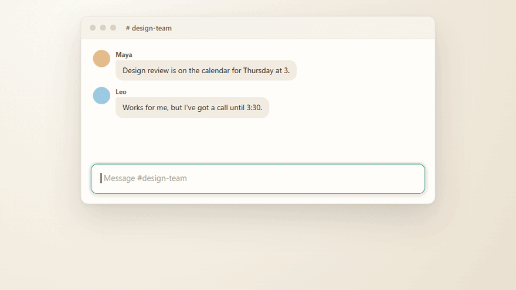
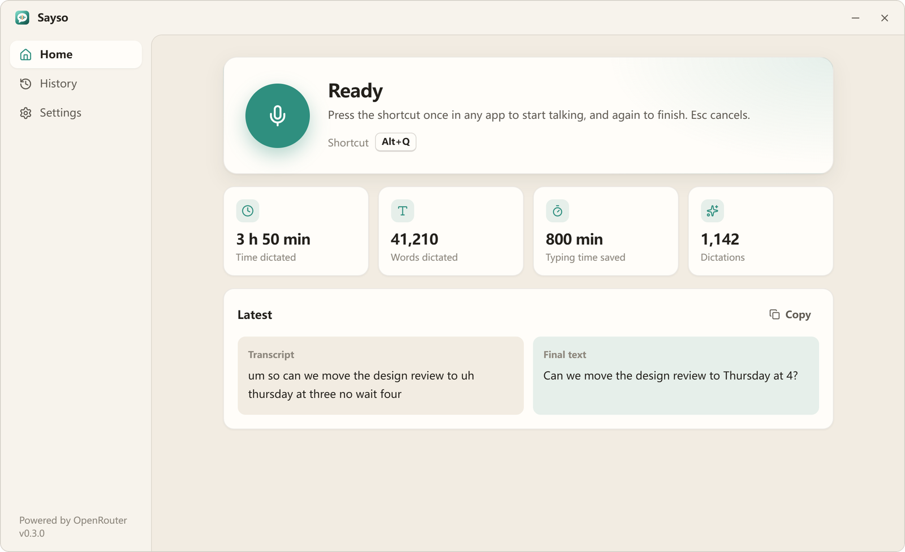
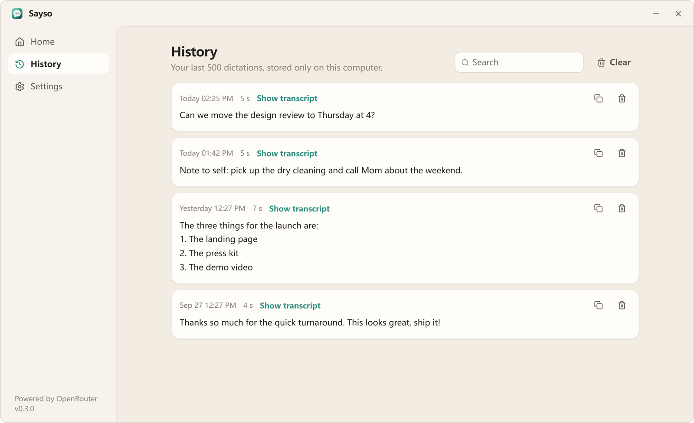
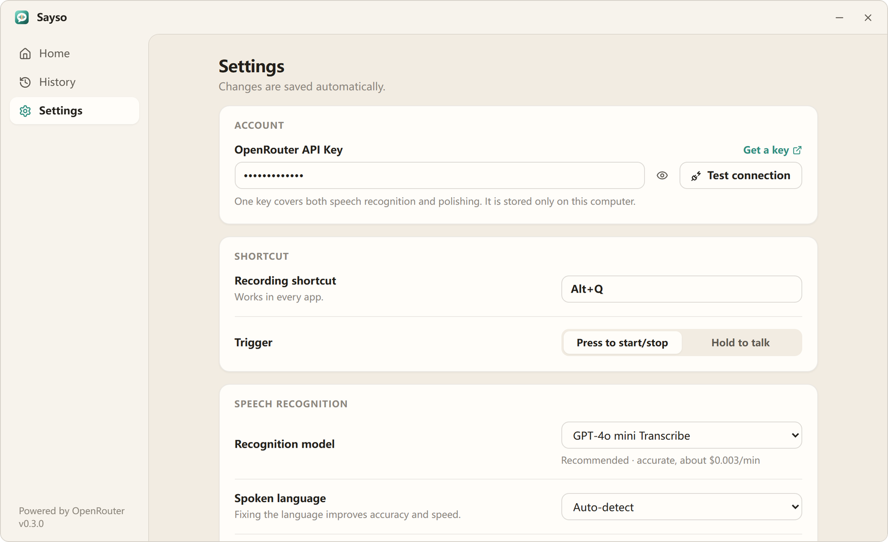
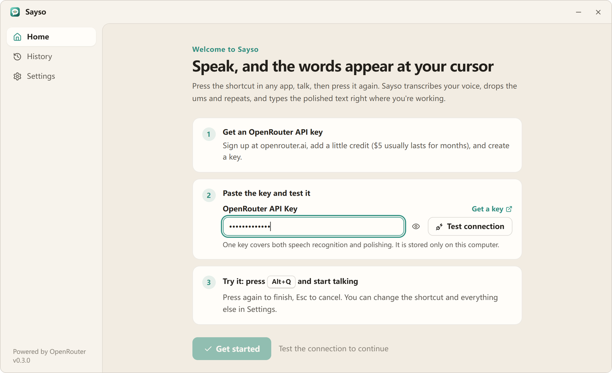
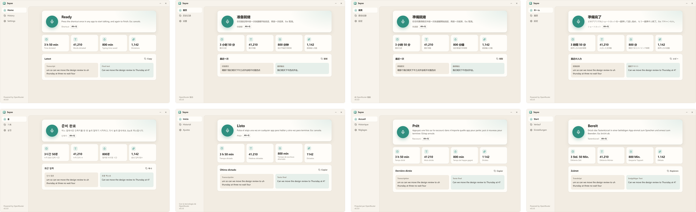

<div align="center">


# Sayso

**Just say so.** Press a hotkey, speak, and clean, polished text appears at your cursor, in any Windows app.

[](https://github.com/jinda-li/GloriousEvolution/releases/latest)
[](https://github.com/jinda-li/GloriousEvolution/releases)


<a href="https://github.com/jinda-li/GloriousEvolution/releases/latest"></a>

**English** · [简体中文](README.zh-CN.md)

<br />



</div>

## Talk the way you think. Get the text you meant.

You ramble, backtrack and say "um". Sayso keeps what you meant and drops the rest, then types it straight into Slack, Word, your browser, your IDE, anywhere with a cursor.

| | |
|---|---|
| **One hotkey, every app** | Press `Alt+Q`, talk, press again. Or hold to talk. `Esc` cancels. |
| **Polished, not just transcribed** | Filler words, repeats and self-corrections are removed; punctuation, capitalization and homophones are fixed. Lists come out as lists. |
| **Never translates, never answers** | It writes down what *you* said, in the language you said it, even mid-sentence switches like Chinese and English. |
| **Your words, your spelling** | A personal dictionary makes names, products and jargon come out right every time. |
| **Nothing lost** | If polishing fails, you still get the raw transcript. No text field focused? A floating pill offers one-click copy. |
| **Private by default** | Audio stays in memory and is never written to disk. History lives only on your PC, and you can turn it off. |
| **Cheap** | Usually well under **$0.01 per minute** of dictation, pay-as-you-go through a single OpenRouter key. |

## Screenshots

<table>
  <tr>
    <td width="50%">
      <picture>
        <source media="(prefers-color-scheme: dark)" srcset="docs/assets/home-en-dark.png" />
        
      </picture>
      <p align="center"><b>Home</b>: your stats and the latest dictation, before and after</p>
    </td>
    <td width="50%">
      <picture>
        <source media="(prefers-color-scheme: dark)" srcset="docs/assets/history-en-dark.png" />
        
      </picture>
      <p align="center"><b>History</b>: search, copy, or compare with the raw transcript</p>
    </td>
  </tr>
  <tr>
    <td width="50%">
      <picture>
        <source media="(prefers-color-scheme: dark)" srcset="docs/assets/settings-en-dark.png" />
        
      </picture>
      <p align="center"><b>Settings</b>: hotkey, models, microphone, dictionary</p>
    </td>
    <td width="50%">
      <picture>
        <source media="(prefers-color-scheme: dark)" srcset="docs/assets/onboarding-en-dark.png" />
        
      </picture>
      <p align="center"><b>Setup</b>: paste one key and you're dictating in a minute</p>
    </td>
  </tr>
</table>

Light and dark themes follow Windows automatically.

## Speaks your language

The interface is available in **English, 简体中文, 繁體中文, 日本語, 한국어, Español, Français and Deutsch**, and follows your Windows language out of the box (switch any time in Settings). Speech recognition itself handles dozens of languages, including mixed-language speech.



## Get started in 60 seconds

1. **Download** `Sayso_0.3.0_x64-setup.exe` from the [latest release](https://github.com/jinda-li/GloriousEvolution/releases/latest) and run it. No admin rights needed. Prefer no installer? Grab the portable `.zip` instead.
2. **Create a key** at [openrouter.ai/settings/keys](https://openrouter.ai/settings/keys) and add a few dollars of credit.
3. **Paste the key** into Sayso, click **Test connection**, then **Get started**.
4. Click into any text field and press **`Alt+Q`**. Talk. Press it again.

> [!NOTE]
> OpenRouter only serves audio requests when the account balance is at least $0.50, so free-tier keys need a small top-up.

## How it works

```
Alt+Q ──▶ 16 kHz mic capture (in memory) ──▶ speech-to-text ──▶ polish with an LLM ──▶ typed at your cursor
```

Everything runs on one [OpenRouter](https://openrouter.ai) key:

- **Speech-to-text** via `/api/v1/audio/transcriptions`. Default `openai/gpt-4o-mini-transcribe`; Qwen3 ASR, Whisper, Gemini, Voxtral and Deepgram are one click away.
- **Polishing** via `/api/v1/chat/completions`. Default `google/gemini-3.1-flash-lite` (about half a second); Claude Haiku, GPT-4.1 mini and Qwen are also built in, or type any model id.
- Any endpoint that speaks the OpenAI `/audio/transcriptions` and `/chat/completions` APIs works too (Advanced settings).

## FAQ

<details>
<summary><b>Windows SmartScreen says "Windows protected your PC".</b></summary>

The installer is not code-signed yet. Click **More info** then **Run anyway**. The build is produced by GitHub Actions straight from this repository's source.
</details>

<details>
<summary><b>Where is my data?</b></summary>

Settings are in `%APPDATA%\com.sayso.desktop\settings.json` and history in `history.json` next to it. Audio is only held in memory and sent to the speech model you choose; nothing else leaves your PC.
</details>

<details>
<summary><b>I used GloriousEvolution before.</b></summary>

Sayso is the same app with a new name. On first launch it copies your key, settings and history over automatically. You can then uninstall GloriousEvolution from Windows Settings.
</details>

<details>
<summary><b>Can I change the hotkey?</b></summary>

Yes. Settings, Shortcut, click the field and press any combination. Choose between *press to start/stop* and *hold to talk*.
</details>

## Build from source

Requirements: Node 20+, Rust stable (MSVC toolchain) and WebView2 (preinstalled on Windows 10/11).

```bash
npm install
npm run tauri dev      # run in development
npm run tauri build    # NSIS installer in src-tauri/target/release/bundle/nsis
```

`npm run dev` alone serves the UI in a browser with a mocked backend. Add `?lang=ja` (or any supported locale) to preview a language.

Translations live in [`src/i18n/locales`](src/i18n/locales) (UI) and [`src-tauri/src/i18n.rs`](src-tauri/src/i18n.rs) (errors, progress and tray). Pull requests for new languages are welcome.
