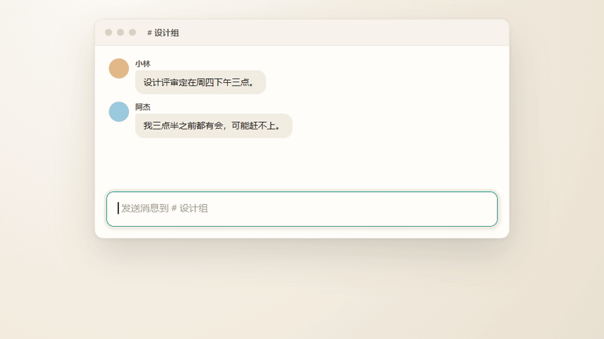
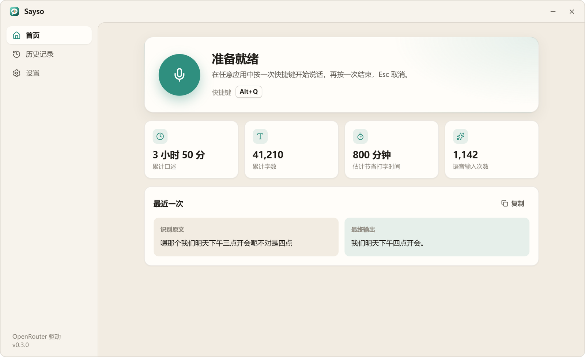
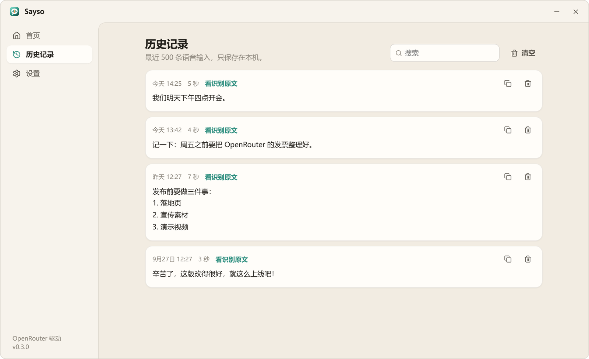
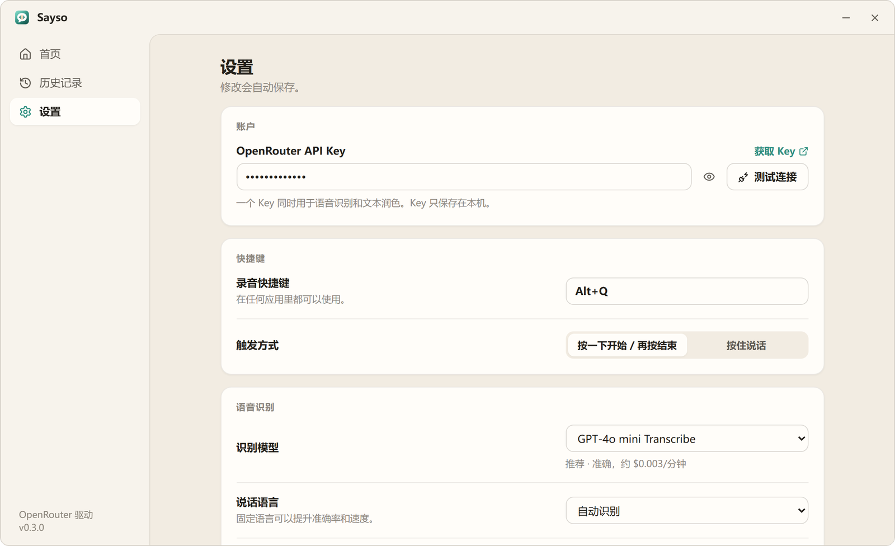
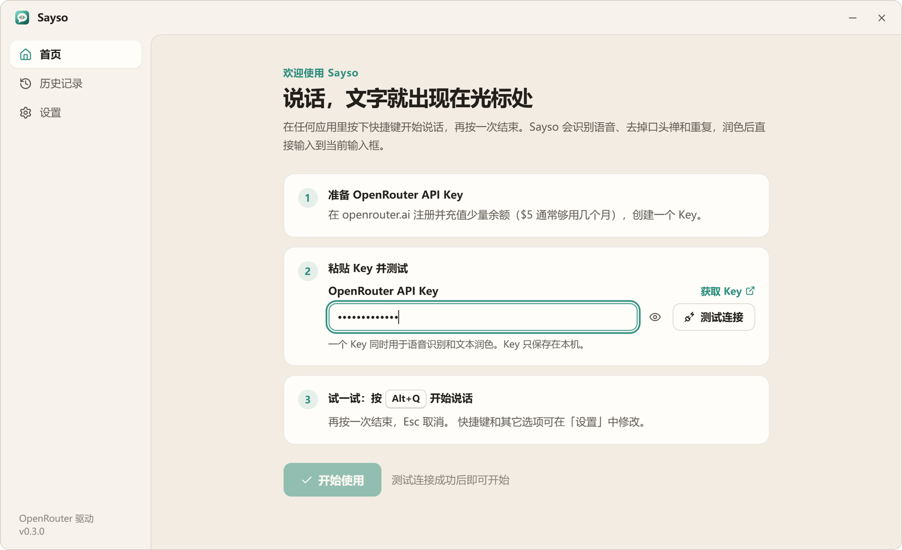

<div align="center">


# Sayso

**说到，就写到。** 按下快捷键开口说话，干净通顺的文字直接出现在光标处。适用于任何 Windows 应用。

免费开源（MIT 许可证）。**使用你自己的 [OpenRouter](https://openrouter.ai) Key**：无需注册 Sayso 账号，没有订阅费，只按实际用量向 OpenRouter 付费。

[](https://github.com/jinda-li/Sayso/releases/latest)
[](https://github.com/jinda-li/Sayso/releases)


[](LICENSE)

<a href="https://github.com/jinda-li/Sayso/releases/latest"></a>

[English](README.md) · **简体中文**

<br />



</div>

## 想到哪说到哪，打出来的是你真正想说的

说话难免“嗯、啊、那个”，说错了还会改口。Sayso 只留下你最终想表达的意思，然后直接输入到微信、飞书、Word、浏览器、IDE……任何有光标的地方。

| | |
|---|---|
| **一个快捷键，所有应用** | 按 `Alt+Q` 开始说话，再按一次结束；也可以按住说话。`Esc` 取消。 |
| **不只是转写，而是润色** | 去掉口头禅、重复和改口，修正标点、大小写和同音错字。说的是列表，出来就是列表。 |
| **不翻译，也不乱回答** | 忠实记下你说的话、用你说的语言，中英混说也保持原样。 |
| **你的词，你的写法** | 个人词典让人名、产品名和专业术语每次都写对。 |
| **绝不丢字** | 润色失败时照样输出原始识别；没有输入框时，浮窗一键复制。 |
| **默认保护隐私** | 音频只在内存中，从不写入磁盘。历史记录只存在本机，也可以关闭。 |
| **用你自己的 OpenRouter 账户** | Sayso 没有服务器，也不收订阅费。它用*你自己的* API Key 直接调用 OpenRouter，从*你的* OpenRouter 余额按量扣费：通常每分钟口述**不到 $0.01**。 |

## 截图

<table>
  <tr>
    <td width="50%">
      <picture>
        <source media="(prefers-color-scheme: dark)" srcset="docs/assets/home-zh-dark.png" />
        
      </picture>
      <p align="center"><b>首页</b>：使用统计，以及最近一次的原文与润色结果</p>
    </td>
    <td width="50%">
      <picture>
        <source media="(prefers-color-scheme: dark)" srcset="docs/assets/history-zh-dark.png" />
        
      </picture>
      <p align="center"><b>历史记录</b>：搜索、复制、对照识别原文</p>
    </td>
  </tr>
  <tr>
    <td width="50%">
      <picture>
        <source media="(prefers-color-scheme: dark)" srcset="docs/assets/settings-zh-dark.png" />
        
      </picture>
      <p align="center"><b>设置</b>：快捷键、模型、麦克风、个人词典</p>
    </td>
    <td width="50%">
      <picture>
        <source media="(prefers-color-scheme: dark)" srcset="docs/assets/onboarding-zh-dark.png" />
        
      </picture>
      <p align="center"><b>首次设置</b>：粘贴一个 Key，一分钟就能用上</p>
    </td>
  </tr>
</table>

浅色 / 深色主题自动跟随 Windows。

## 多语言界面

界面支持 **简体中文、繁體中文、English、日本語、한국어、Español、Français、Deutsch**，默认跟随 Windows 系统语言，也可以在设置中随时切换。语音识别本身支持数十种语言，包括中英混说。


## 60 秒上手

你需要一个自己的 OpenRouter 账户并充值少量余额。Sayso 本身免费。

1. 从 [最新版本](https://github.com/jinda-li/Sayso/releases/latest) **下载** `Sayso_0.3.0_x64-setup.exe` 并运行，无需管理员权限。不想安装？下载便携版 `.zip`，解压即用。
2. 在 [openrouter.ai/settings/keys](https://openrouter.ai/settings/keys) **创建 Key**，并充值几美元。
3. 把 Key **粘贴**到 Sayso，点 **测试连接**，再点 **开始使用**。
4. 点进任意输入框，按 **`Alt+Q`**，说话，再按一次。

> [!NOTE]
> OpenRouter 要求账户余额至少 $0.50 才会处理音频请求，免费额度的 Key 需要先少量充值。

## 工作原理

```
Alt+Q ──▶ 16 kHz 麦克风采集（仅内存） ──▶ 语音识别 ──▶ 大模型润色 ──▶ 输入到光标处
```

全部使用你自己的 [OpenRouter](https://openrouter.ai) Key。音频和文字从你的电脑直接发送到 OpenRouter，中间没有任何 Sayso 服务器，用量可在你的 OpenRouter 后台查看。

- **语音识别**：`/api/v1/audio/transcriptions`，默认 `openai/gpt-4o-mini-transcribe`；Qwen3 ASR（中文与方言更强）、Whisper、Gemini、Voxtral、Deepgram 一键切换。
- **文本润色**：`/api/v1/chat/completions`，默认 `google/gemini-3.1-flash-lite`（约 0.5 秒）；内置 Claude Haiku、GPT-4.1 mini、Qwen，也可填写任意模型 ID。
- 也支持任何兼容 OpenAI `/audio/transcriptions` 与 `/chat/completions` 的接口（高级设置）。

## 常见问题

<details>
<summary><b>Windows 提示“Windows 已保护你的电脑”？</b></summary>

安装包暂未进行代码签名。点击 **更多信息**，再点 **仍要运行** 即可。安装包由 GitHub Actions 直接从本仓库源码构建。
</details>

<details>
<summary><b>数据存在哪里？</b></summary>

设置在 `%APPDATA%\com.sayso.desktop\settings.json`，历史记录在同目录的 `history.json`。音频只保存在内存中，并仅发送给你选择的语音模型。
</details>

<details>
<summary><b>之前用的是 GloriousEvolution？</b></summary>

Sayso 就是它的新名字。首次启动会自动迁移 Key、设置和历史记录，之后可以在 Windows 设置里卸载 GloriousEvolution。
</details>

<details>
<summary><b>快捷键能改吗？</b></summary>

可以。设置 → 快捷键，点击输入框后按下任意组合键即可；还可选择“按一下开始 / 再按结束”或“按住说话”。
</details>

## 从源码构建

需要 Node 20+、Rust stable（MSVC 工具链）和 WebView2（Windows 10/11 已预装）。

```bash
npm install
npm run tauri dev      # 开发模式运行
npm run tauri build    # 生成 NSIS 安装包：src-tauri/target/release/bundle/nsis
```

单独运行 `npm run dev` 可在浏览器中预览界面（后端为模拟数据），加上 `?lang=ja` 等参数可预览对应语言。

翻译文件位于 [`src/i18n/locales`](src/i18n/locales)（界面）和 [`src-tauri/src/i18n.rs`](src-tauri/src/i18n.rs)（错误提示、进度和托盘菜单），欢迎提交新语言。

## 许可证

[MIT](LICENSE) © Jinda Li
